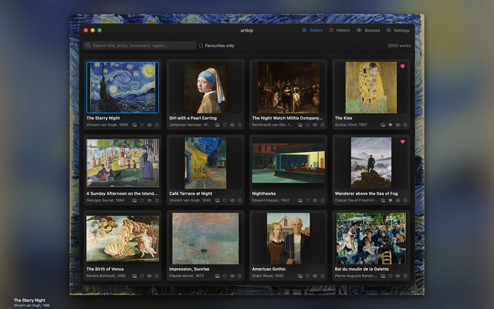
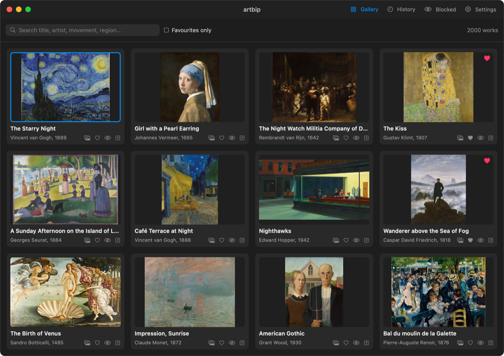
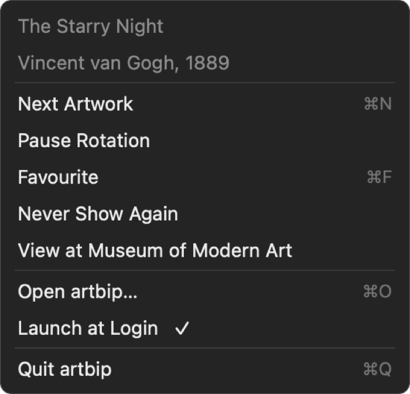
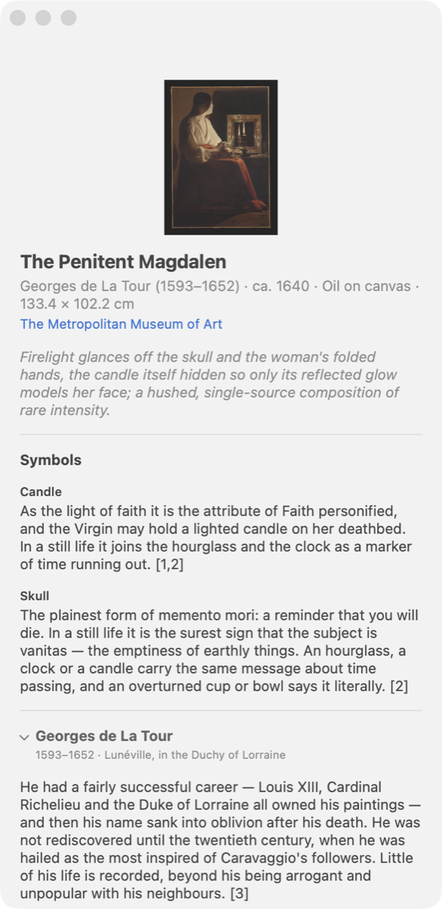

# artbip

artbip is a Mac menu-bar app (with a CLI) that sets a different public-domain
painting as your desktop wallpaper on a schedule. The collection is about
2,000 works curated from Wikimedia Commons and five museum open-access programs; each has a short
caption and a record of its public-domain status. It's a successor in spirit
to Artpip, a similar app that shut down years ago.

There is no account, no telemetry, and no server behind it. The app talks
only to the museum and Wikimedia image hosts listed in the manifest, and it
works offline once images are cached.



## Install

Needs macOS 15+.

**Download**: grab `artbip-x.y.z.zip` from the
[latest release](https://github.com/mcginn/artbip/releases), unzip, and move
`artbip.app` to `/Applications`. The app is not notarized (no Apple Developer
account behind it), so the first launch is blocked: open System Settings →
Privacy & Security, scroll to the artbip message, and click **Open Anyway**.

**Or build from source** (Swift 6.1 toolchain — Xcode or Command Line Tools;
locally built apps aren't quarantined, so Gatekeeper stays quiet):

```sh
bash scripts/make_app.sh          # or: nix run .#build
cp -R dist/artbip.app /Applications/
open /Applications/artbip.app
```

## The app

An icon appears in the menu bar with the essentials: next artwork, pause,
favourite, never-show-again, restore your original wallpaper, launch at
login. "Open artbip…" opens the full window: a searchable gallery of the
collection, rotation history, the blocklist, and settings (interval from 15
minutes to a month, blurred-art or palette background, wall label, margin,
cache budget). Closing the window leaves the app running in the menu bar.

<p>
  
  
</p>

"About This Artwork" opens a panel beside the wallpaper: the wall-label
details, what tradition the picture belongs to, who painted it, and what any
symbols in it traditionally mean. Every claim lists the book and page it came
from, and where the sources are thin it says nothing rather than guessing.

<p>
  
</p>

### CLI

The same engine ships inside the bundle (symlink it onto your PATH):

```sh
ln -s /Applications/artbip.app/Contents/MacOS/artbip ~/.local/bin/artbip

artbip rotate next            # advance the wallpaper now
artbip rotate daemon          # rotate on a timer (foreground)
artbip rotate current         # what's on the desktop, with its wall label
artbip rotate fav / block     # favourite or never-show the current work
artbip rotate restore         # put back the pre-artbip wallpaper (pauses)
artbip rotate pause / resume
artbip rotate history/status
artbip compose --id met-436535 --background palette --label   # one-off PNG
```

App and CLI share state (`~/Library/Application Support/artbip/`), so
favourites made in one appear in the other. Run either the app's own timer
*or* the daemon, not both.

### nix-darwin

The flake exports a module that runs the rotation daemon as a launchd user
agent (an alternative to keeping the app running):

```nix
inputs.artbip.url = "github:mcginn/artbip";   # or path:/path/to/checkout

# in darwinConfigurations…
modules = [
  artbip.darwinModules.default
  { services.artbip.enable = true; }
];
```

## The collection

The collection was curated offline by the pipeline in this repo (see
`DESIGN.md`). Candidates come from six sources: the Art Institute of
Chicago, the Met, Cleveland, the National Gallery of Art, the Rijksmuseum,
and Wikidata/Commons. After cross-source deduplication and licence and
image-quality gates, an LLM vision pass scored all 4,653 candidates for
significance and wrote the wall-label captions. The final 2,000 were selected
by score, with per-artist caps and a manual pass to drop bad scans.

- `data/manifest.json` — the versioned collection contract the app consumes.
- `data/scores.json` — every score and caption, so re-curation never re-scores.
- `data/overrides.json` — hand edits (exclusions, pins, corrections) that
  survive re-runs of the pipeline.

To tweak the collection: edit `data/overrides.json` (or selection parameters
in `data/curate.json`), run `artbip curate emit`, and rebuild the app bundle
so it carries the fresh manifest.

## License

Code is MIT. The curation data in `data/` is CC0. The artworks are public
domain or CC0, with licence evidence recorded per-work in the manifest —
see [LICENSE](LICENSE).
